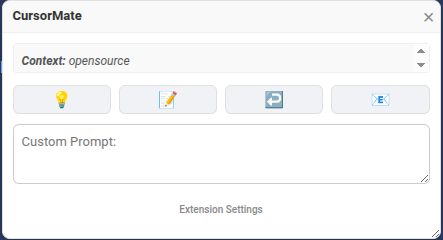
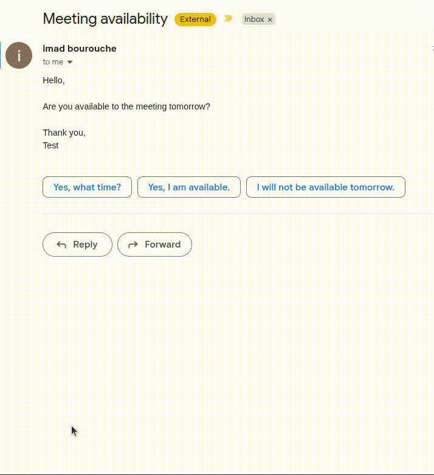

  

<h1 align="center">CursorMate</h1>

  <strong>CursorMate is a Chrome extension that brings AI capabilities directly to your text selection. Select any text on a webpage and instantly get explanations, summaries, translations, or custom AI responses using your preferred AI model.</strong>

 

  

## 🚀 Demo

  <h3>Summarize Text 📝</h3>
  

  <h3>Respond to an Email 📧</h3>
  

## ✨ Features

- **🚀 Smart Actions**: Explain, Summarize, Fix Syntax, Reply, and Answer questions about selected text.
- **🎨 Customizable**: Add your own AI actions with unique emojis and prompts.
- **🤖 Bring Your Own Model**: Use any OpenAI-compatible API (e.g., DeepSeek, OpenAI, Local LLMs) with your own API Key and URL.
- **⚙️ Flexible Behavior**: Choose how the extension activates.

## 📥 Installation

1. Clone or download this repository.
2. Open Chrome and navigate to `chrome://extensions/`.
3. Enable **Developer mode** in the top-right corner.
4. Click **Load unpacked**.
5. Select the `CursorMate` folder.
6. Update your model configuration in the extension settings.

## 🖱️ Usage

1. **Select text** on any webpage.
2. Depending on your settings:
   - Click the **floating icon** that appears.
   - Or wait for the **popup** to open automatically.
   - Or click the **CursorMate icon** in your browser toolbar.
3. Choose an action (e.g., 💡 Explain, 📝 Summarize) or type your own prompt.
4. View the **streaming AI response** in real-time.
5. **Copy** or **use** the response anywhere.

## ⚙️ Configuration

Click the **"EXTENSION OPTIONS"** link in the popup (or right-click the extension icon and select "Settings") to access the settings page.

### 🛠️ Extension Behavior
- **Show Floating Icon** (Default): Displays a small icon near the selection.
- **Show Popup Immediately**: Skips the icon and opens the panel right away.
- **Manual Trigger Only**: Keeps the UI hidden until you explicitly click the extension icon.

### 🤖 Model Configuration
- **Model Name**: The ID of the model you want to use (e.g., `deepseek-chat`, `gpt-4o`).
- **API URL**: The full endpoint URL for chat completions (e.g., `https://api.deepseek.com/v1/chat/completions`).
- **API Key**: Your secret API key.  
> **Note**: These settings are stored locally in your browser (`chrome.storage.sync`) and are never sent to any third-party server other than the API URL you specify.

### 🎨 Manage Actions (Predefined & Custom Prompts)
- **Add New Action**: Create custom actions with a Name, Emoji, and Prompt.
  - Use `{text}` as a placeholder for the selected text in your prompt.
  - Example: `Translate this to Spanish: {text}`
- **Emoji Picker**: Use the built-in picker to find the perfect emoji for your action.
- **Remove Actions**: Delete any actions you no longer need.

## 🛠️ Tech Stack

- **Manifest V3**: Secure and modern extension architecture.
- **Generic Model Support**: Compatible with any OpenAI-format API.
- **Vanilla JS & CSS**: Lightweight and fast, with no heavy framework dependencies.
- **Chrome Storage**: Syncs your settings and custom actions across devices.